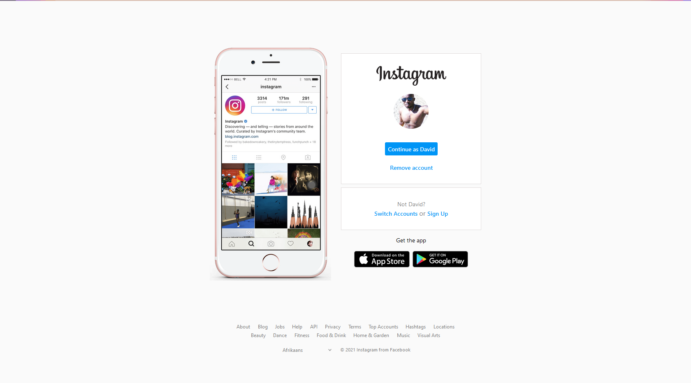

# Instagram login interface clone

This project is a challenge from the DIO (Digital Inovation One) bootcamp, in which we are going to recreate the Instagram login interface.

### About this project

This project was created in order to practice my skills with HTML and CSS.

## Tech Stack

## Link

https://instagram-dio-master.vercel.app/

  
## Demo

  
## Screenshots

#### Desktop view

  
## Author

- [David Nunes](https://www.github.com/Dnuns)
